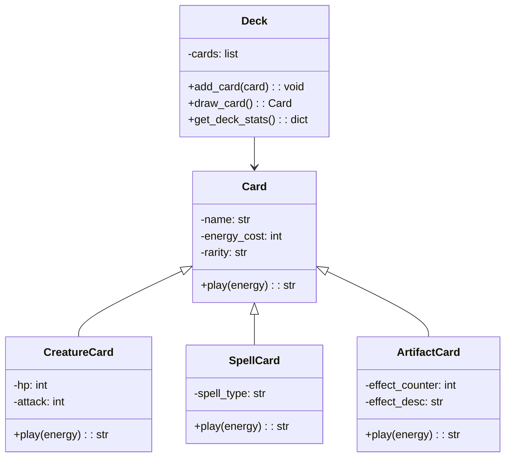

```mermaid
classDiagram
    class Card {
        -name: str
        -energy_cost: int
        -rarity: str
        +play(energy): str
    }
    
    class CreatureCard {
        -hp: int
        -attack: int
        +play(energy): str
    }
    
    class SpellCard {
        -spell_type: str
        +play(energy): str
    }
    
    class ArtifactCard {
        -effect_counter: int
        -effect_desc: str
        +play(energy): str
    }
    
    class Deck {
        -cards: list
        +add_card(card): void
        +draw_card(): Card
        +get_deck_stats(): dict
    }
    
    Card <|-- CreatureCard
    Card <|-- SpellCard
    Card <|-- ArtifactCard
    Deck --> Card
```